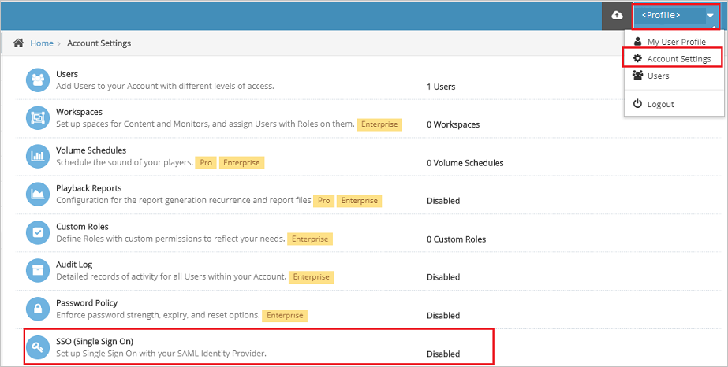

## Prerequisites

To configure Azure AD integration with Watch by Colors, you need the following items:

- An Azure AD subscription
- A Watch by Colors single sign-on enabled subscription

> **Note:**
> To test the steps in this tutorial, we do not recommend using a production environment.

To test the steps in this tutorial, you should follow these recommendations:

- Do not use your production environment, unless it is necessary.
- If you don't have an Azure AD trial environment, you can get a [free account](https://azure.microsoft.com/free/).

### Configuring Watch by Colors for single sign-on

1. Open a new web browser window and sign into your Watch by Colors company site as an administrator and perform the following steps:

1. On the top-right corner of the page, click on **profile** > **Account Settings** > **SSO (Single Sign On)**.

	

1. On the **SSO (Single Sign On)** page, perform the following steps:

	

	a. Toggle **Enable SAML** to **ON**.

    b. In the **URL** text box, paste the **Federation Metadata Url**, which you have copied from Azure portal.

    c. Click **Import**, then the following fields get auto-populated automatically on the page.

    d. Click **Save**.

## Quick Reference

* **Login URL** : %metadata:singleSignOnServiceUrl%

* **[Download Azure AD Signing Certifcate](%metadata:CertificateDownloadRawUrl%)**

* **[Download SAML Metadata file](%metadata:metadataDownloadUrl%)**

## Additional Resources

* [How to integrate Watch by Colors with Azure Active Directory](https://docs.microsoft.com/azure/active-directory/saas-apps/watch-by-colors-tutorial)
