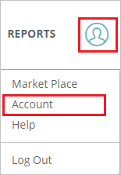
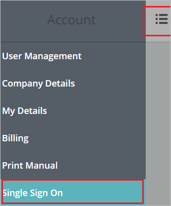
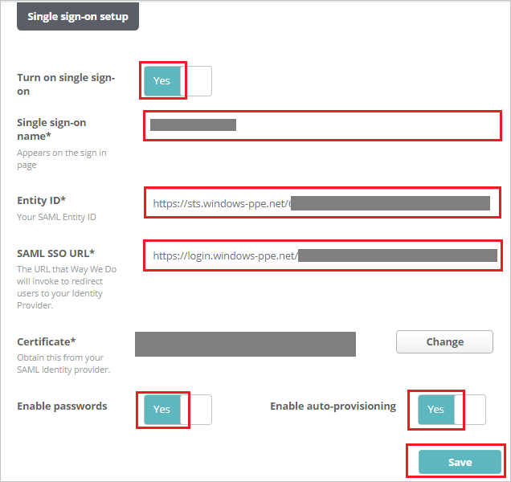

## Prerequisites

To configure Azure AD integration with Way We Do, you need the following items:

- An Azure AD subscription
- A Way We Do single sign-on enabled subscription

> **Note:**
> To test the steps in this tutorial, we do not recommend using a production environment.

To test the steps in this tutorial, you should follow these recommendations:

- Do not use your production environment, unless it is necessary.
- If you don't have an Azure AD trial environment, you can [get a one-month trial](https://azure.microsoft.com/pricing/free-trial/).

### Configuring Way We Do for single sign-on

1. In a different web browser window, login to Way We Do as a Security Administrator.

2. Click the **person icon** in the top right corner of any page in Way We Do, then click **Account** in the dropdown menu.

	 

3. Click the **menu icon** to open the push navigation menu and Click **Single Sign On**.

	

4. On the **Single sign-on setup** page, perform the following steps:

	

	a. Click the **Turn on single sign-on** toggle to **Yes** to enable Single Sign-On.

	b. In the **Single sign-on name** textbox, enter your name.

	c. In the **Entity ID** textbox, paste the value of **Azure AD SAML Entity ID** : %metadata:IssuerUri%, which you have copied from the Azure portal.

	d. In the **SAML SSO URL** textbox, paste the value of **Azure AD Single Sign-On Service URL** : %metadata:singleSignOnServiceUrl%, which you have copied from the Azure portal.

	e. Upload the **[Downloaded Azure AD Signing Certifcate](%metadata:CertificateDownloadRawUrl%)** by clicking the **select** button next to **Certificate**.

	f. **Optional Settings** -
	
	* Enable Passwords - When this option is disabled, the regular password functions for Way We Do so that users can only use single sign-on.

	* Enable Auto-provisioning - When this is enabled, the email address used to sign-on will be automatically compared to the list of users in Way We Do. If the email address does not match an active user in Way We Do, it automatically adds a new user account for the person signing in, requesting any missing information.

	  > **Note:**
	  > Users added through single sign-on are added as general users and are not assigned a role in the system. An Administrator is able to go in and modify their security role as an editor or administrator and can also assign one or several Org Chart roles. 

	g. Click **Save** to persist your settings.

## Quick Reference

* **Azure AD Single Sign-On Service URL** : %metadata:singleSignOnServiceUrl%

* **Azure AD Sign Out URL** : %metadata:singleSignOutServiceUrl%

* **Azure AD SAML Entity ID** : %metadata:IssuerUri%

* **[Download Azure AD Signing Certifcate](%metadata:CertificateDownloadRawUrl%)**

## Additional Resources

* [How to integrate Way We Do with Azure Active Directory](https://docs.microsoft.com/azure/active-directory/saas-apps/waywedo-tutorial)
