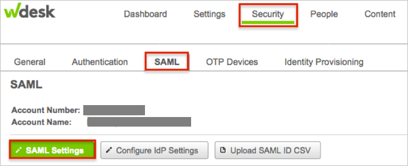
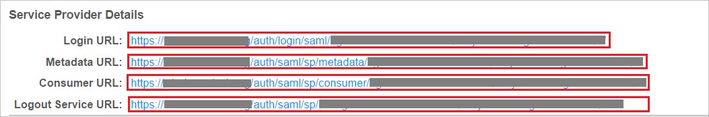
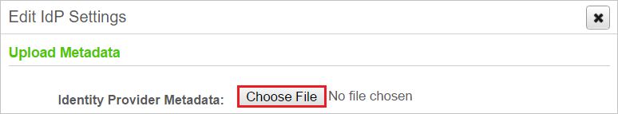

## Prerequisites

To configure Azure AD integration with Wdesk, you need the following items:

- An Azure AD subscription
- A Wdesk single-sign on enabled subscription

> **Note:**
> To test the steps in this tutorial, we do not recommend using a production environment.

To test the steps in this tutorial, you should follow these recommendations:

- You should not use your production environment, unless this is necessary.
- If you don't have an Azure AD trial environment, you can get an one-month trial [here](https://azure.microsoft.com/pricing/free-trial/).

### Configuring Wdesk for single sign-on

1. In a different web browser window, login to Wdesk as a Security Administrator.

2. In the bottom left, click **Admin** and choose **Account Admin**:
 
     

3. In Wdesk Admin, navigate to **Security**, then **SAML** > **SAML Settings**:

    

4. Under **General Settings**, check the **Enable SAML Single Sign On**:

    

5. Under **Service Provider Details**, perform the following steps:

    

	  a. Copy the **Login URL** and paste it in **Sign-on Url** textbox on Azure portal.
   
	  b. Copy the **Metadata Url** and paste it in **Identifier** textbox on Azure portal.
	   
	  c. Copy the **Consumer url** and paste it in **Reply Url** textbox on Azure portal.
   
	  d. Click **Save** on Azure portal to save the changes.      

6. Click **Configure IdP Settings** to open **Edit IdP Settings** dialog. Click **Choose File** to locate the **Metadata.xml** file you saved from Azure portal, then upload it.
    
    
  
7. Click **Save changes**.

    

## Quick Reference

* **[Download SAML Metadata file](%metadata:metadataDownloadUrl%)**

## Additional Resources

* [How to integrate Wdesk with Azure Active Directory](https://docs.microsoft.com/azure/active-directory/active-directory-saas-wdesk-tutorial)
