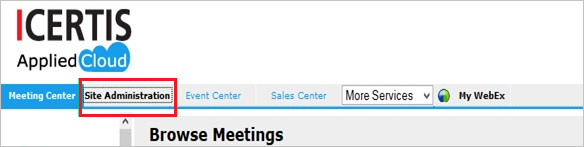
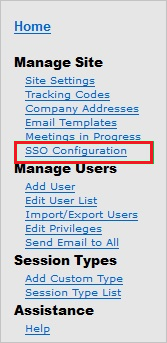
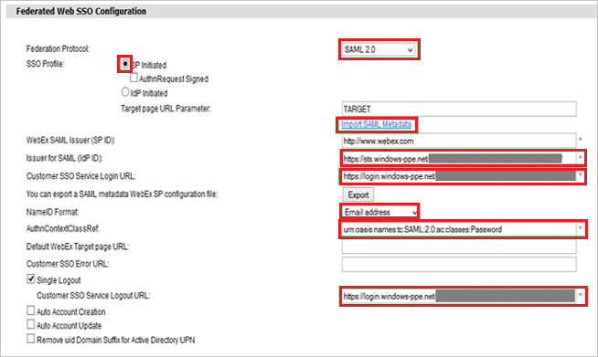

## Prerequisites

To configure Azure AD integration with Cisco WebEx, you need the following items:

- An Azure AD subscription
- A Cisco WebEx single-sign on enabled subscription

> **Note:**
> To test the steps in this tutorial, we do not recommend using a production environment.

To test the steps in this tutorial, you should follow these recommendations:

- Do not use your production environment, unless it is necessary.
- If you don't have an Azure AD trial environment, you can get a one-month trial [here](https://azure.microsoft.com/pricing/free-trial/).

### Configuring Cisco WebEx for single sign-on

1. To configure single sign-on on **Cisco Webex** side, you need to send the downloaded **Metadata XML** and **SAML Entity ID** to [Cisco Webex Client support team](https://www.webex.co.in).

2. In a different web browser window, log in to your Cisco Webex company site as an administrator.

3. In the menu on the top, click **Site Administration**.

	

4. In the **Manage Site** section, click **SSO Configuration**.
   
	

5. In the Federated Web SSO Configuration section, perform the following steps:
   
	  

	a. From the **Federation Protocol** list, select **SAML 2.0**.

	b. Create a **Base-64 encoded** file from your downloaded certificate.
  
    > **TIP**
    > For more information, see [how to convert a binary certificate into a text file](http://youtu.be/PlgrzUZ-Y1o)
    
	c. Open your base-64 encoded certificate in notepad, and then copy the content of it.

	d. Click **Import SAML Metadata**, and then paste your base-64 encoded certificate.

	e. In the Azure portal, on the **Configure single sign-on at Cisco Webex** dialog page, copy the **Azure AD SMAL Entity ID** : %metadata:IssuerUri% value, and then paste it into the **Issuer for SAML (IdP ID)** textbox.

	f. In the Azure portal, on the **Configure single sign-on at Cisco Webex** dialog page, copy the **Azure AD Single Sign-On Service URL** : %metadata:singleSignOnServiceUrl% value, and then paste it into the **Customer SSO Service Login URL** textbox.

	g. From the **NameID Format** list, select **Email address**.

	h. In the **AuthnContextClassRef** textbox, type **urn:oasis:names:tc:SAML:2.0:ac:classes:Password**.

	i. In the Azure portal, on the **Configure single sign-on at Cisco Webex** dialog page, copy the **Azure AD Sign Out URL** : %metadata:singleSignOutServiceUrl% value, and then paste it into the **Customer SSO Service Logout URL** textbox.
   
	j. Click **Update**.

## Quick Reference

* **Azure AD Single Sign-On Service URL** : %metadata:singleSignOnServiceUrl%

* **Azure AD Sign Out URL** : %metadata:singleSignOutServiceUrl%

* **Azure AD SAML Entity ID** : %metadata:IssuerUri%

* **[Download Azure AD Signing Certificate](%metadata:CertificateDownloadRawUrl%)**

* **[Download SAML Metadata file](%metadata:metadataDownloadUrl%)**

## Additional Resources

* [How to integrate Cisco WebEx with Azure Active Directory](https://docs.microsoft.com/azure/active-directory/active-directory-saas-cisco-webex-tutorial)
