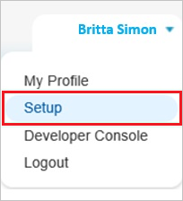
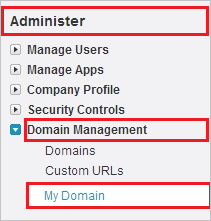
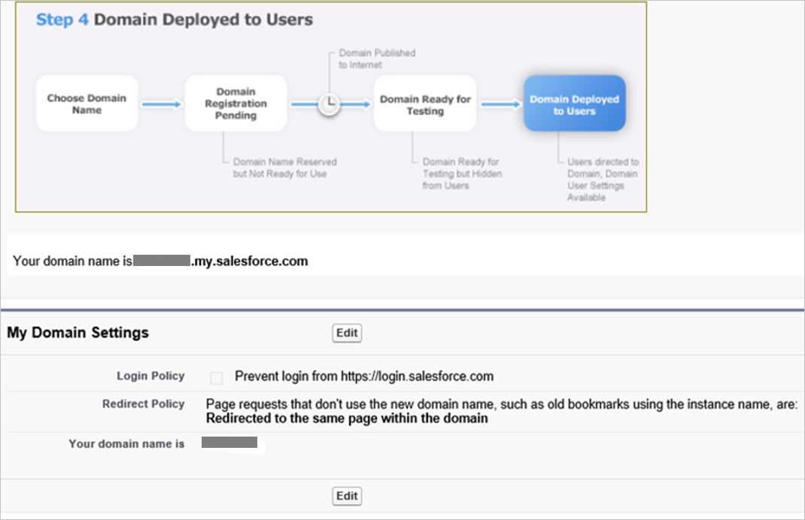
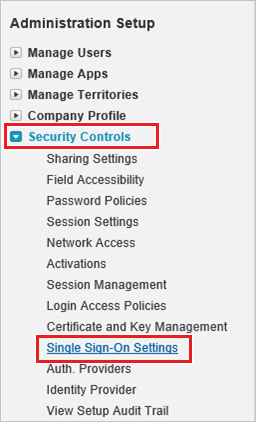
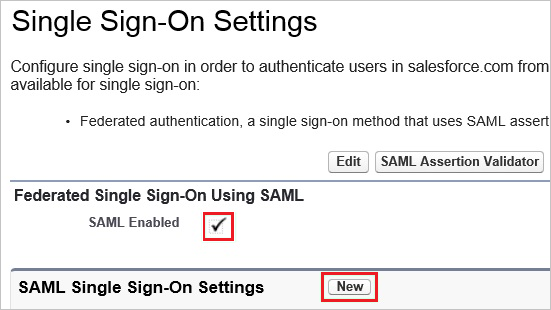
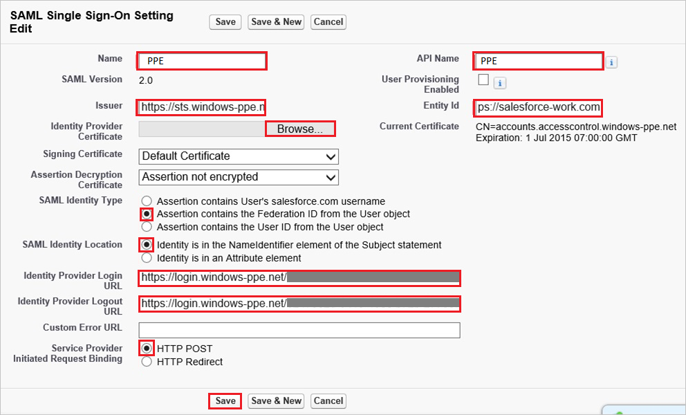
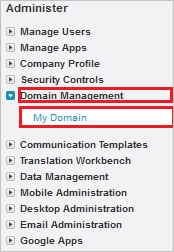
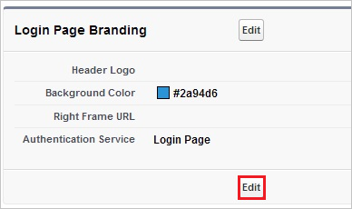
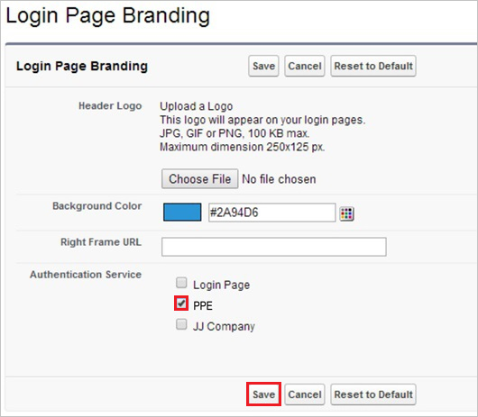

## Prerequisites

To configure Azure AD integration with Work.com, you need the following items:

- An Azure AD subscription
- A Work.com single sign-on enabled subscription

> **Note:**
> To test the steps in this tutorial, we do not recommend using a production environment.

To test the steps in this tutorial, you should follow these recommendations:

- Do not use your production environment, unless it is necessary.
- If you don't have an Azure AD trial environment, you can get a one-month trial [here](https://azure.microsoft.com/pricing/free-trial/).

### Configuring Work.com for single sign-on

1. Log in to your Work.com tenant as administrator.

2. Go to **Setup**.
   
    

3. On the left navigation pane, in the **Administer** section, click **Domain Management** to expand the related section, and then click **My Domain** to open the **My Domain** page. 
   
    

4. To verify that your domain has been set up correctly, make sure that it is in “**Step 4 Deployed to Users**” and review your “**My Domain Settings**”.
   
    

5. Log in to your Work.com tenant.

6. Go to **Setup**.
    
    

7. Expand the **Security Controls** menu, and then click **Single Sign-On Settings**.
    
    

8. On the **Single Sign-On Settings** dialog page, perform the following steps:
    
    
    
    a. Select **SAML Enabled**.
    
    b. Click **New**.

9. In the **SAML Single Sign-On Settings** section, perform the following steps:
    
    
    
    a. In the **Name** textbox, type a name for your configuration.  
       
    > [!NOTE]
    > Providing a value for **Name** does automatically populate the **API Name** textbox.
    
    b. In **Issuer** textbox, paste the value of **Azure AD SAML Entity ID** : %metadata:IssuerUri% which you have copied from Azure portal.
    
    c. To upload the **[Downloaded Azure AD Signing Certificate (Base64 encoded)](%metadata:certificateDownloadBase64Url%)** from Azure portal, click **Browse**.
    
    d. In the **Entity Id** textbox, type `https://salesforce-work.com`.
    
    e. As **SAML Identity Type**, select **Assertion contains the Federation ID from the User object**.
    
    f. As **SAML Identity Location**, select **Identity is in the NameIdentfier element of the Subject statement**.
    
    g. In **Identity Provider Login URL** textbox, paste the value of **Azure AD Single Sign-On Service URL** : %metadata:singleSignOnServiceUrl% which you have copied from Azure portal.

    h. In **Identity Provider Logout URL** textbox, paste the value of **Azure AD Sign Out URL** : %metadata:singleSignOutServiceUrl% which you have copied from Azure portal.
    
    i. As **Service Provider Initiated Request Binding**, select **HTTP Post**.
    
    j. Click **Save**.

10. In your Work.com classic portal, on the left navigation pane, click **Domain Management** to expand the related section, and then click **My Domain** to open the **My Domain** page. 
    
    

11. On the **My Domain** page, in the **Login Page Branding** section, click **Edit**.
    
    

12. On the **Login Page Branding** page, in the **Authentication Service** section, the name of your **SAML SSO Settings** is displayed. Select it, and then click **Save**.
    
    

## Quick Reference

* **Azure AD Single Sign-On Service URL** : %metadata:singleSignOnServiceUrl%

* **Azure AD Sign Out URL** : %metadata:singleSignOutServiceUrl%

* **Azure AD SAML Entity ID** : %metadata:IssuerUri%

* **[Download Azure AD Signing Certificate (Base64 encoded)](%metadata:certificateDownloadBase64Url%)**

## Additional Resources

* [How to integrate Work.com with Azure Active Directory](https://docs.microsoft.com/azure/active-directory/active-directory-saas-work-com-tutorial)
