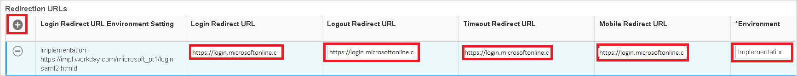
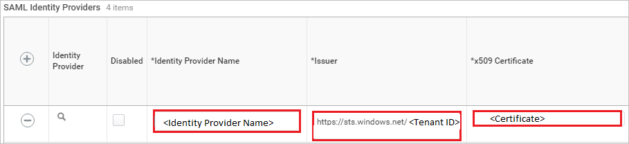
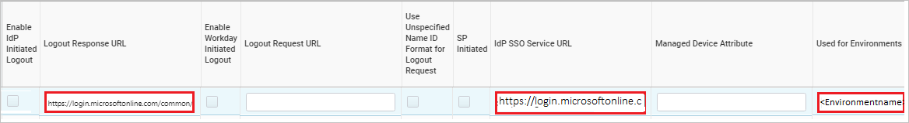
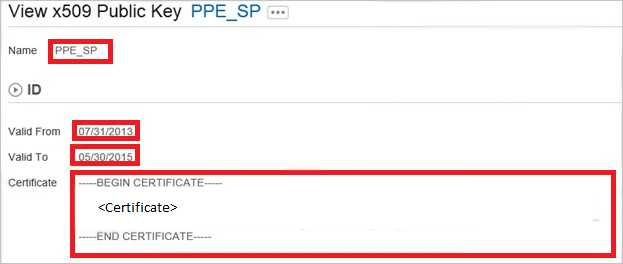

## Prerequisites

To configure Azure AD integration with Workday, you need the following items:

- An Azure AD subscription
- A Workday single sign-on enabled subscription

> **Note:**
> To test the steps in this tutorial, we do not recommend using a production environment.

To test the steps in this tutorial, you should follow these recommendations:

- Do not use your production environment, unless it is necessary.
- If you don't have an Azure AD trial environment, you can [get a one-month trial](https://azure.microsoft.com/pricing/free-trial/).

### Configuring Workday for single sign-on

1. In a different web browser window, log in to your Workday company site as an administrator.

2. In the **Search box** search with the name **Edit Tenant Setup – Security** on the top left side of the home page.
   
    

3. In the **Redirection URLs** section, perform the following steps:
   
    
   
    a. Click **Add Row**.
   
    b. In the **Login Redirect URL** textbox and the **Mobile Redirect URL** textbox, type the **Sign-on URL** you have entered on the **Workday Domain and URLs** section of the Azure portal.
   
    c. In the Azure portal, on the **Configure sign-on** window, copy the **Sign-Out URL**, and then paste it into the **Logout Redirect URL** textbox.

    d. In **Used for Environments** textbox, select the environment name.  

    >[!NOTE]
    > The value of the Environment attribute is tied to the value of the tenant URL:  
    >-If the domain name of the Workday tenant URL starts with impl for example: *https://impl.workday.com/\<tenant\>/login-saml2.htmld*), the **Environment** attribute must be set to Implementation.  
    >-If the domain name starts with something else, you need to contact [Workday Client support team](https://www.workday.com/en-us/partners-services/services/support.html) to get the matching **Environment** value.

4. In the **SAML Setup** section, perform the following steps:
   
    
   
    a.  Select **Enable SAML Authentication**.
   
    b.  Click **Add Row**.

5. In the **SAML Identity Providers** section, perform the following steps:
   
    
   
    a. In the **Identity Provider Name** textbox, type a provider name (for example: *SPInitiatedSSO*).
   
    b. In the Azure portal, on the **Configure sign-on** window, copy the **SAML Entity ID** value, and then paste it into the **Issuer** textbox.

    
   
    c. Select **Enable idp Initiated Logout**.
   
    d. In the Azure portal, on the **Configure sign-on** window, copy the **Sign-Out URL** value, and then paste it into the **Logout Response URL** textbox.

	e. In the Azure portal, on the **Configure sign-on** window, copy the **SAML Single Sign-On Service URL** value, and then paste it into the **IdP SSO Service URL** textbox.

	f. In **Used for Environments** textbox, select the environment name.

    g. Click **Identity Provider Public Key Certificate**, and then click **Create**. 

    

    h. Click **Create x509 Public Key**. 

    

6. In the **View x509 Public Key** section, perform the following steps: 
   
     
   
    a. In the **Name** textbox, type a name for your certificate (for example: *PPE\_SP*).
   
    b. In the **Valid From** textbox, type the valid from attribute value of your certificate.
   
    c.  In the **Valid To** textbox, type the valid to attribute value of your certificate.
   
    > [!NOTE]
    > You can get the valid from date and the valid to date from the downloaded certificate by double-clicking it.  The dates are listed under the **Details** tab.
    > 
    >
   
    d.  Open your base-64 encoded certificate in notepad, and then copy the content of it.
   
    e.  In the **Certificate** textbox, paste the content of your clipboard.
   
    f.  Click **OK**.

7. Perform the following steps: 
   
    
   
    a.  In the **Service Provider ID** textbox, type **http://www.workday.com**.
   
    b. Select **Do Not Deflate SP-initiated Authentication Request**.
   
    c. As **Authentication Request Signature Method**, select **SHA256**. 
   
     
   
    d. Click **OK**. 
   
    

## Quick Reference

* **Azure AD Single Sign-On Service URL** : %metadata:singleSignOnServiceUrl%

* **Azure AD Sign Out URL** : %metadata:singleLogoutService%

* **Azure AD SAML Entity ID** : %metadata:IssuerUri%

* **[Download Azure AD Signing Certifcate (Base64 encoded)](%metadata:certificateDownloadBase64Url%)**

## Additional Resources

* [How to integrate Workday with Azure Active Directory](https://docs.microsoft.com/azure/active-directory/active-directory-saas-workday-tutorial)
