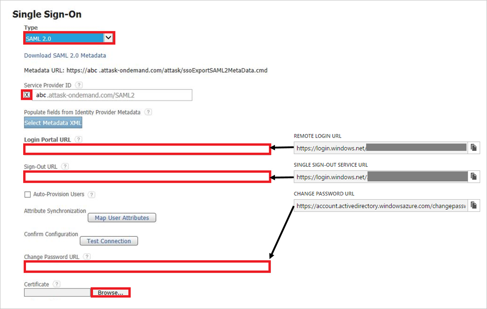

## Prerequisites

To configure Azure AD integration with Workfront, you need the following items:

- An Azure AD subscription
- A Workfront single-sign on enabled subscription

> **Note:**
> To test the steps in this tutorial, we do not recommend using a production environment.

To test the steps in this tutorial, you should follow these recommendations:

- Do not use your production environment, unless it is necessary.
- If you don't have an Azure AD trial environment, you can get a one-month trial [here](https://azure.microsoft.com/pricing/free-trial/).

### Configuring Workfront for single sign-on

1. Sign-on to your Workfront company site as administrator.

2. Go to **Single Sign On Configuration**.

3. On the **Single Sign-On** dialog, perform the following steps
	
	 
   
    a. As **Type**, select **SAML 2.0**.
   
    b. Select **Service Provider ID**.
   
    c. Paste the **Azure AD Single Sign-On Service URL** : %metadata:singleSignOnServiceUrl% into the **Login Portal URL** textbox.
   
    d. Paste **Azure AD Sign Out URL** : %metadata:singleSignOutServiceUrl% into the **Sign-Out URL** textbox.
   
    e. Paste **Change Password URL** into the **Change Password URL** textbox.
   
    f. Click **Save**.

## Quick Reference

* **Azure AD Single Sign-On Service URL** : %metadata:singleSignOnServiceUrl%

* **Azure AD Sign Out URL** : %metadata:singleSignOutServiceUrl%

* **[Download Azure AD Signing Certificate (Base64 encoded)](%metadata:certificateDownloadBase64Url%)**

## Additional Resources

* [How to integrate Workfront with Azure Active Directory](https://docs.microsoft.com/azure/active-directory/active-directory-saas-attask-tutorial)
