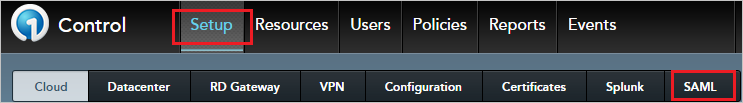
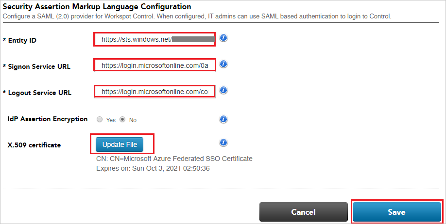

## Prerequisites

To configure Azure AD integration with Workspot Control, you need the following items:

- An Azure AD subscription
- A Workspot Control single sign-on enabled subscription

> **Note:**
> To test the steps in this tutorial, we do not recommend using a production environment.

To test the steps in this tutorial, you should follow these recommendations:

- Do not use your production environment, unless it is necessary.
- If you don't have an Azure AD trial environment, you can [get a one-month trial](https://azure.microsoft.com/pricing/free-trial/).

### Configuring Workspot Control for single sign-on

7. In a different web browser window, login to Workspot Control as a Security Administrator.

8. In the toolbar at the top of the page, click **Setup**, then navigate to **SAML**.

	

9. On the **Security Assertion Markup Language Configuration** page, perform the following steps:
 
	

	a. In the **Entity ID** textbox, paste the value of **Azure Ad Identifier** : %metadata:IssuerUri% which you have copied from the Azure portal.   

	b.In the **Signon Service URL** textbox, paste the value of **Login URL** : %metadata:singleSignOnServiceUrl% which you have copied from the Azure portal.

	c. In the **Logout Service URL** textbox, paste the value of **Logout URL** : %metadata:singleSignOutServiceUrl% which you have copied from the Azure portal. 

	d. Click on **Update File** button to Upload the **[Downloaded Azure AD Signing Certifcate (Base64 encoded)](%metadata:certificateDownloadBase64Url%)** from the Azure portal, into the X.509 certificate.

	e. Click **Save**.

## Quick Reference

* **Azure AD Single Sign-On Service URL** : %metadata:singleSignOnServiceUrl%

* **Azure AD Sign Out URL** : %metadata:singleSignOutServiceUrl%

* **Azure AD SAML Entity ID** : %metadata:IssuerUri%

* **[Download Azure AD Signing Certifcate (Base64 encoded)](%metadata:certificateDownloadBase64Url%)**

## Additional Resources

* [How to integrate Workspot Control with Azure Active Directory](https://docs.microsoft.com/azure/active-directory/saas-apps/workspotcontrol-tutorial)
