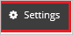
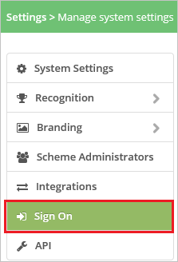
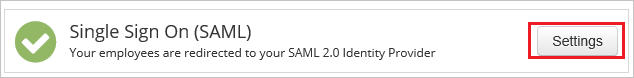
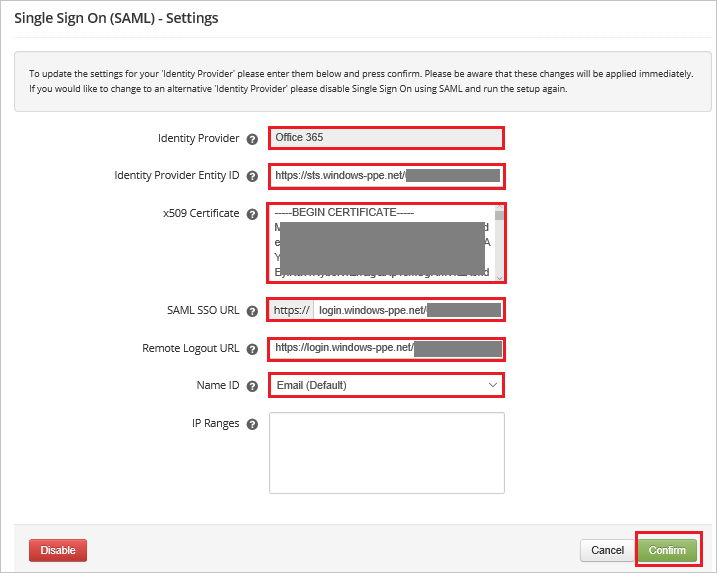

## Prerequisites

To configure Azure AD integration with Workstars, you need the following items:

- An Azure AD subscription
- A Workstars single sign-on enabled subscription

> **Note:**
> To test the steps in this tutorial, we do not recommend using a production environment.

To test the steps in this tutorial, you should follow these recommendations:

- Do not use your production environment, unless it is necessary.
- If you don't have an Azure AD trial environment, you can [get a one-month trial](https://azure.microsoft.com/pricing/free-trial/).

### Configuring Workstars for single sign-on

1. In another browser window, sign on to your Workstars company site as an administrator.

2. In the main toolbar, click **Settings**.

	

3. Go to **Sign On** > **Settings**.

	

    

4. On the **Single Sign On (SAML) - Settings** page, perform the following steps:
	
	

	a. In **Identity Provider Name** textbox, type **Office 365**.

	b. In the **Identity Provider Entity ID** textbox, paste the value of **SAML Entity ID**, which you have copied from Azure portal.

	c. Copy the content of the **[Downloaded Azure AD Signing Certifcate (Base64 encoded)](%metadata:certificateDownloadBase64Url%)** file in notepad, and then paste it into the **x509 Certificate** textbox. 

	d. In the **SAML SSO URL** textbox, paste the value of **Azure AD Single Sign-On Service URL** : %metadata:singleSignOnServiceUrl%, which you have copied from Azure portal.
	
	e. In the **Remote Logout URL** textbox, paste the value of **Sign-Out URL**, which you have copied from Azure portal. 

	f. select **Name ID** as **Email (Default)**.

	g. Click **Confirm**.

## Quick Reference

* **Azure AD Single Sign-On Service URL** : %metadata:singleSignOnServiceUrl%

* **[Download Azure AD Signing Certifcate (Base64 encoded)](%metadata:certificateDownloadBase64Url%)**

## Additional Resources

* [How to integrate Workstars with Azure Active Directory](https://docs.microsoft.com/azure/active-directory/active-directory-saas-workstars-tutorial)
