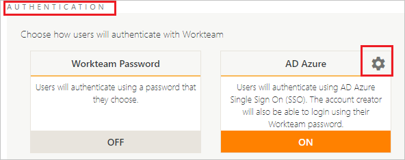
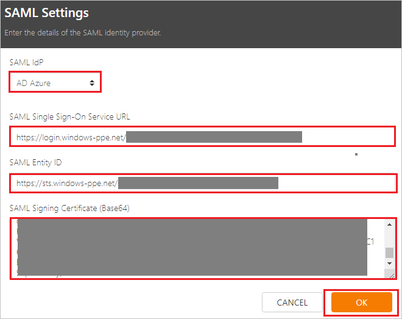

## Prerequisites

To configure Azure AD integration with Workteam, you need the following items:

- An Azure AD subscription
- A Workteam single sign-on enabled subscription

> **Note:**
> To test the steps in this tutorial, we do not recommend using a production environment.

To test the steps in this tutorial, you should follow these recommendations:

- Do not use your production environment, unless it is necessary.
- If you don't have an Azure AD trial environment, you can [get a one-month trial](https://azure.microsoft.com/pricing/free-trial/).

### Configuring Workteam for single sign-on

1. In a different web browser window, log in to Workteam as a Security Administrator.

2. In the top right corner click on **profile logo** and then click on **Organization settings**. 

	

3. Under **AUTHENTICATION** section, click on **Settings logo**.

     

4. On the **SAML Settings** page, perform the following steps:

	 

	a. Select **SAML IdP** as **AD Azure**.

	b. In the **SAML Single Sign-On Service URL** textbox, paste the value of **Azure AD Single Sign-On Service URL** : %metadata:singleSignOnServiceUrl%, which you have copied from the Azure portal.

	c. In the **SAML Entity ID** textbox, paste the value of **Azure AD SAML Entity ID** : %metadata:IssuerUri%, which you have copied from the Azure portal.

	d. In Notepad, open the **[Downloaded Azure AD Signing Certifcate (Base64 encoded)](%metadata:certificateDownloadBase64Url%)** from the Azure portal, copy its content, and then paste it into the **SAML Signing Certificate (Base64)** box.

	e. Click **OK**.

## Quick Reference

* **Azure AD Single Sign-On Service URL** : %metadata:singleSignOnServiceUrl%

* **Azure AD Sign Out URL** : %metadata:singleSignOutServiceUrl%

* **Azure AD SAML Entity ID** : %metadata:IssuerUri%

* **[Download Azure AD Signing Certifcate (Base64 encoded)](%metadata:certificateDownloadBase64Url%)**

## Additional Resources

* [How to integrate Workteam with Azure Active Directory](https://docs.microsoft.com/azure/active-directory/saas-apps/workteam-tutorial)
