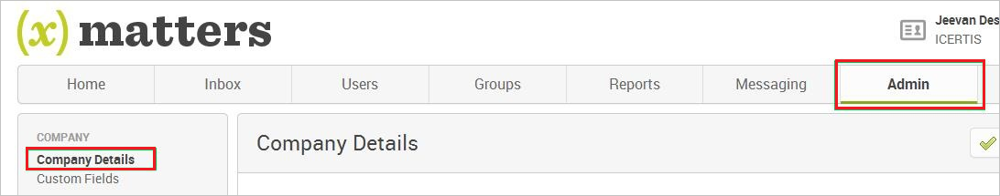
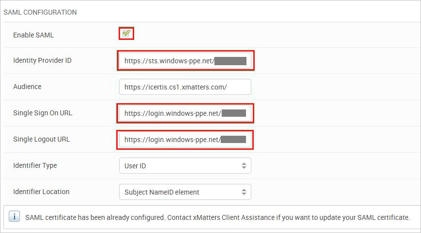
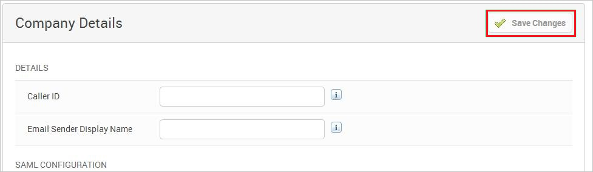

## Prerequisites

To configure Azure AD integration with xMatters OnDemand, you need the following items:

- An Azure AD subscription
- A xMatters OnDemand single sign-on enabled subscription

> **Note:**
> To test the steps in this tutorial, we do not recommend using a production environment.

To test the steps in this tutorial, you should follow these recommendations:

- Do not use your production environment, unless it is necessary.
- If you don't have an Azure AD trial environment, you can get a one-month trial here: [trail offer](https://azure.microsoft.com/pricing/free-trial/).

### Configuring xMatters OnDemand for single sign-on

1. In a different web browser window, log in to your XMatters OnDemand company site as an administrator.

2. In the toolbar on the top, click **Admin**, and then click **Company Details** in the navigation bar on the left side.
   
    

3. On the **SAML Configuration** page, perform the following steps:
   
    
   
    a. Select **Enable SAML**.
   
    b. Paste **Azure AD SAML Entity ID** : %metadata:IssuerUri%, which you have copied from the Azure portal into the **Identity Provider ID** textbox.
   
    c. Paste **Azure AD Single Sign-On Service URL** : %metadata:singleSignOnServiceUrl%, which you have copied from the Azure portal into the **Single Sign On URL** textbox.
   
    d. Paste **Azure AD Sign Out URL** : %metadata:singleSignOutServiceUrl%, which you have copied from the Azure portal into the **Single Logout URL** textbox.
   
    e. On the Company Details page, at the top, click **Save Changes**.
    
    

## Quick Reference

* **Azure AD Single Sign-On Service URL** : %metadata:singleSignOnServiceUrl%

* **Azure AD Sign Out URL** : %metadata:singleSignOutServiceUrl%

* **Azure AD SAML Entity ID** : %metadata:IssuerUri%

* **[Download Azure AD Signing Certifcate (Base64 encoded)](%metadata:certificateDownloadBase64Url%)**

## Additional Resources

* [How to integrate xMatters OnDemand with Azure Active Directory](https://docs.microsoft.com/azure/active-directory/active-directory-saas-xmatters-ondemand-tutorial)
