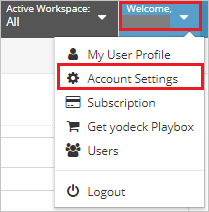
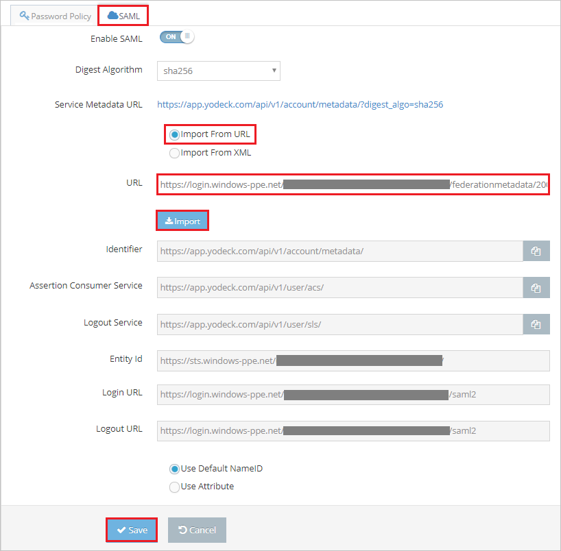

## Prerequisites

To configure Azure AD integration with Yodeck, you need the following items:

- An Azure AD subscription
- A Yodeck single sign-on enabled subscription

> **Note:**
> To test the steps in this tutorial, we do not recommend using a production environment.

To test the steps in this tutorial, you should follow these recommendations:

- Do not use your production environment, unless it is necessary.
- If you don't have an Azure AD trial environment, you can [get a one-month trial](https://azure.microsoft.com/pricing/free-trial/).

### Configuring Yodeck for single sign-on

1. In a different web browser window, log in to your Yodeck company site as an administrator.

2. Click on **User Settings** option form the top right corner of the page and select **Account Settings**.

	

3. Select **SAML** and perform the following steps:

	

	a. Select **Import from URL**.

	b. In the **URL** textbox, paste the **App Federation Metadata Url** value, which you have copied from the Azure portal and click **Import**.

	c. After importing **App Federation Metadata Url**, the remaining fields populate automatically.

	d. Click **Save**.

## Quick Reference

* **[Download SAML Metadata file](%metadata:metadataDownloadUrl%)**

## Additional Resources

* [How to integrate Yodeck with Azure Active Directory](https://docs.microsoft.com/azure/active-directory/active-directory-saas-yodeck-tutorial)
