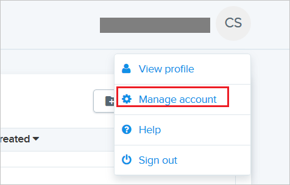
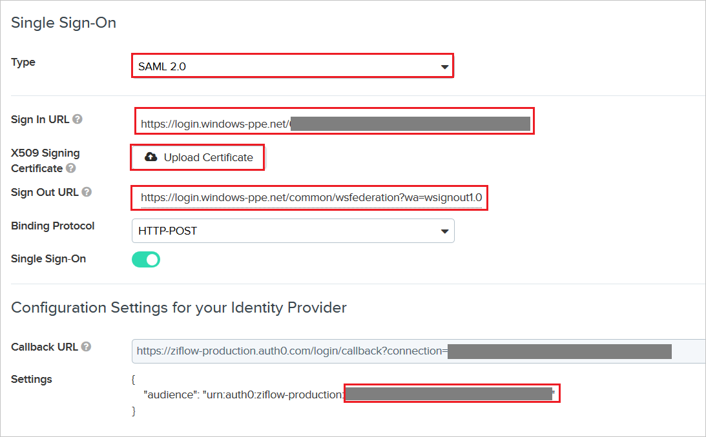

## Prerequisites

To configure Azure AD integration with Ziflow, you need the following items:

- An Azure AD subscription
- A Ziflow single sign-on enabled subscription

> **Note:**
> To test the steps in this tutorial, we do not recommend using a production environment.

To test the steps in this tutorial, you should follow these recommendations:

- Do not use your production environment, unless it is necessary.
- If you don't have an Azure AD trial environment, you can [get a one-month trial](https://azure.microsoft.com/pricing/free-trial/).

### Configuring Ziflow for single sign-on

1. In a different web browser window, login to Ziflow as a Security Administrator.

2. Click on Avatar in the top right corner, and then click **Manage account**.

	

3. In the top left, click **Single Sign-On**.

	

4. On the **Single Sign-On** page, perform the following steps:

	

	a. Select **Type** as **SAML2.0**.

	b.In the **Sign In URL** textbox, paste the value of **Azure AD Single Sign-On Service URL** : %metadata:singleSignOnServiceUrl%, which you have copied from the Azure portal.

    c. Upload the **[Downloaded Azure AD Signing Certifcate (Base64 encoded)](%metadata:certificateDownloadBase64Url%)** that you have downloaded from the Azure portal, into the **X509 Signing Certificate**.

	d. In the **Sign Out URL** textbox, paste the value of **Azure AD Sign Out URL** : %metadata:singleSignOutServiceUrl%, which you have copied from the Azure portal.

	e. From the **Configuration Settings for your Identifier Provider** section, copy the highlighted unique ID value and append it with the Identifier and Sign on URL in the **Ziflow Domain and URLs section** on Azure portal.

## Quick Reference

* **Azure AD Single Sign-On Service URL** : %metadata:singleSignOnServiceUrl%

* **Azure AD Sign Out URL** : %metadata:singleSignOutServiceUrl%

* **[Download Azure AD Signing Certifcate (Base64 encoded)](%metadata:certificateDownloadBase64Url%)**

## Additional Resources

* [How to integrate Ziflow with Azure Active Directory](https://docs.microsoft.com/azure/active-directory/active-directory-saas-ziflow-tutorial)
