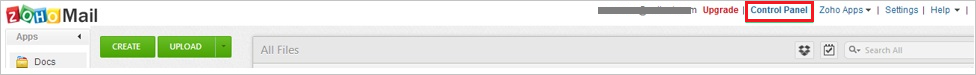
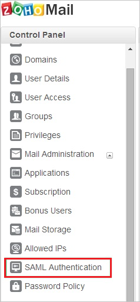
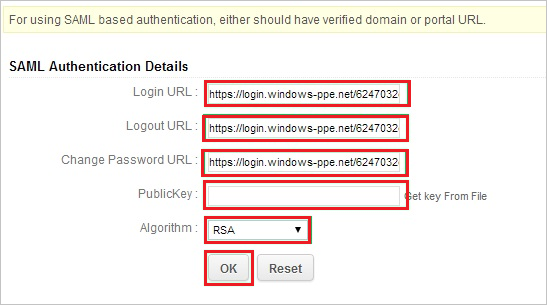

## Prerequisites

To configure Azure AD integration with Zoho, you need the following items:

- An Azure AD subscription
- A Zoho single sign-on enabled subscription

> **Note:**
> To test the steps in this tutorial, we do not recommend using a production environment.

To test the steps in this tutorial, you should follow these recommendations:

- Do not use your production environment, unless it is necessary.
- If you don't have an Azure AD trial environment, you can get a one-month trial [here](https://azure.microsoft.com/pricing/free-trial/).

### Configuring Zoho for single sign-on

1. In a different web browser window, log into your Zoho Mail company site as an administrator.

2. Go to the **Control panel**.
   
    

3. Click the **SAML Authentication** tab.
   
    

4. In the **SAML Authentication Details** section, perform the following steps:
   
    
   
    a. In the **Login URL** textbox, paste **SAML Single Sign-On Service URL** which you have copied from Azure portal.
   
    b. In the **Logout URL** textbox, enter **Azure AD Single Sign-On Service URL** : %metadata:singleSignOnServiceUrl%.
   
    c. In the **Change Password URL** textbox, enter **Change Password URL%metadata:changePasswordUrl%**.
       
    d. Open your [base-64 encoded certificate](%metadata:certificateDownloadBase64Url%) downloaded from Azure portal in notepad, copy the content of it into your clipboard, and then paste it to the **PublicKey** textbox.
   
    e. As **Algorithm**, select **RSA**.
   
    f. Click **OK**.

## Quick Reference

* **Azure AD Single Sign-On Service URL** : %metadata:singleSignOnServiceUrl%

* **Azure AD Sign Out URL** : %metadata:singleSignOutServiceUrl%

* **Azure AD Change Password URL** : %metadata:changePasswordUrl% 

* **[Download Azure AD Signing Certifcate (Base64 encoded)](%metadata:certificateDownloadBase64Url%)**

## Additional Resources

* [How to integrate Zoho with Azure Active Directory](https://docs.microsoft.com/azure/active-directory/active-directory-saas-zoho-mail-tutorial)
