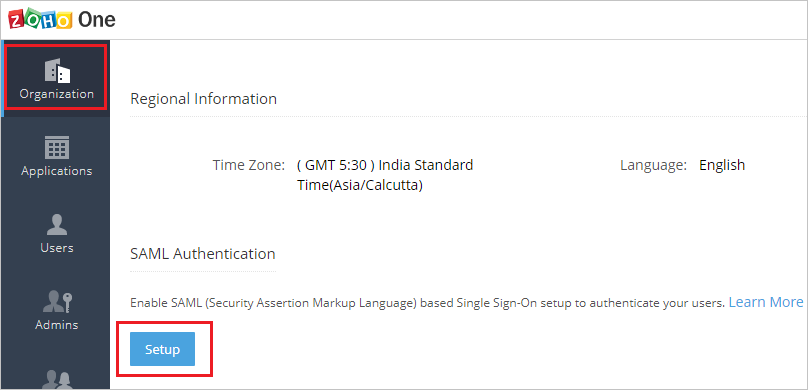
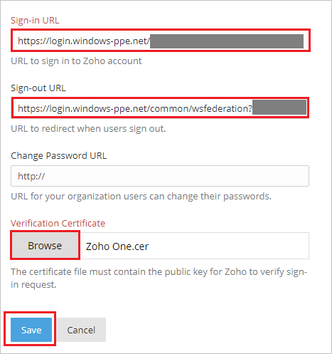
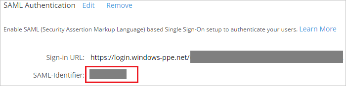
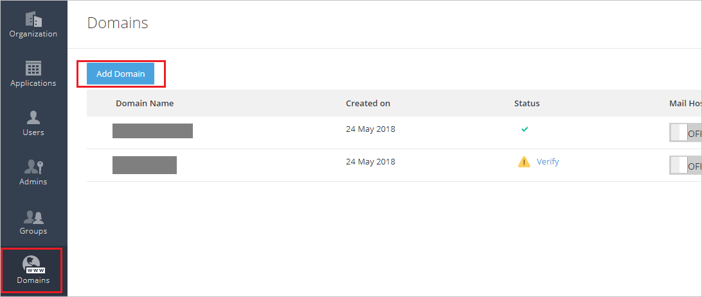
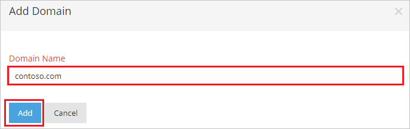

## Prerequisites

To configure Azure AD integration with Zoho One, you need the following items:

- An Azure AD subscription
- A Zoho One single sign-on enabled subscription

> **Note:**
> To test the steps in this tutorial, we do not recommend using a production environment.

To test the steps in this tutorial, you should follow these recommendations:

- Do not use your production environment, unless it is necessary.
- If you don't have an Azure AD trial environment, you can [get a one-month trial](https://azure.microsoft.com/pricing/free-trial/).

### Configuring Zoho One for single sign-on

1. In a different web browser window, log in to your Zoho One company site as an administrator.

2. On the **Organization** tab, Click **Setup** under **SAML Authentication**.

	

3. On the Pop-up page perform the following steps:

	

	a. In the **Sign-in URL** textbox, paste the value of **Azure AD Single Sign-On Service URL** : %metadata:singleSignOnServiceUrl%, which you have copied from Azure portal.

	b. In the **Sign-out URL** textbox, paste the value of **Azure AD Sign Out URL** : %metadata:singleSignOutServiceUrl%, which you have copied from Azure portal.

	c. Click **Browse** to upload the **[Downloaded Azure AD Signing Certifcate (Base64 encoded)](%metadata:certificateDownloadBase64Url%)** from Azure portal.

	d. Click **Save**.

4. After saving the SAML Authentication setup, copy the **SAML-Identfier** value and use this value in the **Reply URL** in the Azure portal, under **Zoho One Domain and URLs** section.

	

5. Go to the **Domains** tab and then click **Add Domain**.

	

6. On the **Add Domain** page, perform the following steps:

	

	a. In the **Domain Name** textbox, type domain like **contoso.com**.

	b. Click **Add**.

	> **Note:**
	>After adding the domain follow [these](https://www.zoho.com/one/help/admin-guide/domain-verification.html) steps to verify your domain. Once the domain is verfified, use your domain name in **Sign-on URL** in **Zoho One Domain and URLs** section in Azure portal.

## Quick Reference

* **Azure AD Single Sign-On Service URL** : %metadata:singleSignOnServiceUrl%

* **Azure AD Sign Out URL** : %metadata:singleSignOutServiceUrl%

* **Azure AD SAML Entity ID** : %metadata:IssuerUri%

* **[Download Azure AD Signing Certifcate (Base64 encoded)](%metadata:certificateDownloadBase64Url%)**

## Additional Resources

* [How to integrate Zoho One with Azure Active Directory](https://docs.microsoft.com/azure/active-directory/active-directory-saas-zohoone-tutorial)
