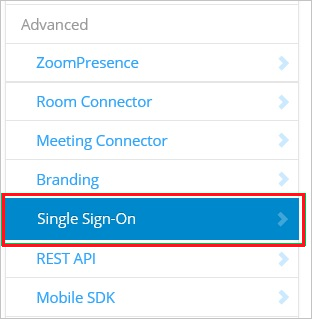
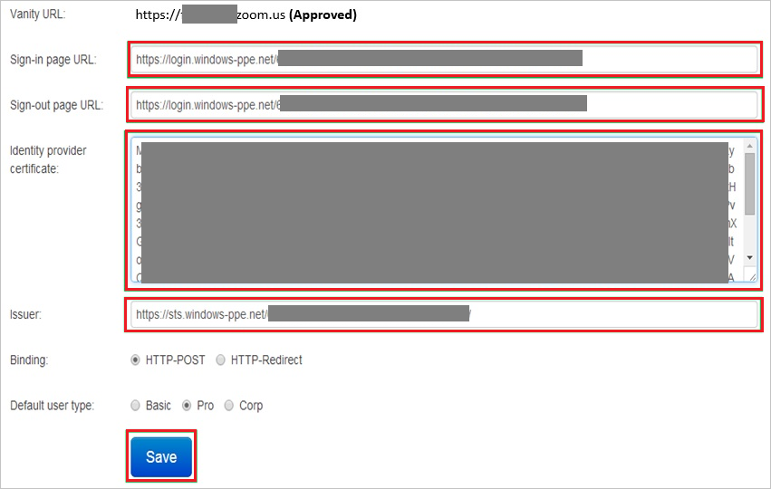

## Prerequisites

To configure Azure AD integration with Zoom, you need the following items:

- An Azure AD subscription
- A Zoom single sign-on enabled subscription

> **Note:**
> To test the steps in this tutorial, we do not recommend using a production environment.

To test the steps in this tutorial, you should follow these recommendations:

- Do not use your production environment, unless it is necessary.
- If you don't have an Azure AD trial environment, you can get a one-month trial [here](https://azure.microsoft.com/pricing/free-trial/).

### Configuring Zoom for single sign-on

1. In a different web browser window, log in to your Zoom company site as an administrator.

2. Click the **Single Sign-On** tab.
   
    

3. Click the **Security Control** tab, and then go to the **Single Sign-On** settings.

4. In the Single Sign-On section, perform the following steps:
   
    
   
    a. In the **Sign-in page URL** textbox, enter **Azure AD Single Sign-On Service URL** : %metadata:singleSignOnServiceUrl%.
   
    b. In the **Sign-out page URL** textbox, enter **Azure AD Sign Out URL** : %metadata:singleSignOutServiceUrl%.
     
    c. Open your [base-64 encoded certificate](%metadata:certificateDownloadBase64Url%) in notepad, copy the content of it into your clipboard, and then paste it to the **Identity provider certificate** textbox.

    d. In the **Issuer** textbox, enter **Azure AD SAML Entity ID** : %metadata:IssuerUri%. 

    e. Click **Save**.

## Quick Reference

* **Azure AD Single Sign-On Service URL** : %metadata:singleSignOnServiceUrl%

* **Azure AD Sign Out URL** : %metadata:singleSignOutServiceUrl%

* **Azure AD SAML Entity ID** : %metadata:IssuerUri%

* **[Download Azure AD Signing Certifcate (Base64 encoded)](%metadata:certificateDownloadBase64Url%)**

## Additional Resources

* [How to integrate Zoom with Azure Active Directory](https://docs.microsoft.com/azure/active-directory/active-directory-saas-zoom-tutorial)
