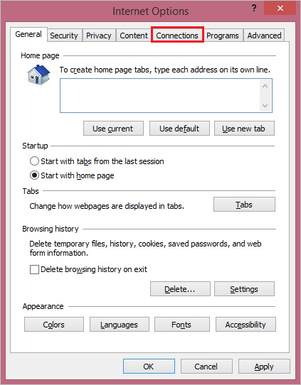

## Prerequisites

To configure Azure AD integration with Zscaler Beta, you need the following items:

- An Azure AD subscription
- A Zscaler Beta single sign-on enabled subscription

> **Note:**
> To test the steps in this tutorial, we do not recommend using a production environment.

To test the steps in this tutorial, you should follow these recommendations:

- Do not use your production environment, unless it is necessary.
- If you don't have an Azure AD trial environment, you can get a one-month trial here: [trail offer](https://azure.microsoft.com/pricing/free-trial/).

### Configuring Zscaler Beta for single sign-on

1. In a different web browser window, log in to your Zscaler Beta company site as an administrator.

2. In the menu on the top, click **Administration**.
   
	

3. Under **Manage Administrators & Roles**, click **Manage Users & Authentication**.   
   			
	

4. In the **Choose Authentication Options for your Organization** section, perform the following steps:   
   				
	
   
    a. Select **Authenticate using SAML Single Sign-On**.

    b. Click **Configure SAML Single Sign-On Parameters**.

5. On the **Configure SAML Single Sign-On Parameters** dialog page, perform the following steps, and then click **Done**

	
	
	a. Paste the **Azure AD Single Sign-On Service URL** : %metadata:singleSignOnServiceUrl% value, which you have copied from the Azure portal into the **URL of the SAML Portal to which users are sent for authentication** textbox.
	
	b. In the **Attribute containing Login Name** textbox, type **NameID**.
	
	c. To upload your **[Downloaded Azure AD Signing Certifcate (Base64 encoded)](%metadata:certificateDownloadBase64Url%)**, click **Zscaler pem**.
	
	d. Select **Enable SAML Auto-Provisioning**.

6. On the **Configure User Authentication** dialog page, perform the following steps:

    
    
    a. Click **Save**.

    b. Click **Activate Now**.

## Configuring proxy settings
### To configure the proxy settings in Internet Explorer

1. Start **Internet Explorer**.

2. Select **Internet options** from the **Tools** menu for open the **Internet Options** dialog.   
  	
	 

3. Click the **Connections** tab.   
  
	 

4. Click **LAN settings** to open the **LAN Settings** dialog.

5. In the Proxy server section, perform the following steps:   
   
	

    a. Select **Use a proxy server for your LAN**.

    b. In the Address textbox, type **gateway.zscalerbeta.net**.

    c. In the Port textbox, type **80**.

    d. Select **Bypass proxy server for local addresses**.

    e. Click **OK** to close the **Local Area Network (LAN) Settings** dialog.

6. Click **OK** to close the **Internet Options** dialog.

## Quick Reference

* **Azure AD Single Sign-On Service URL** : %metadata:singleSignOnServiceUrl%

* **[Download Azure AD Signing Certifcate (Base64 encoded)](%metadata:certificateDownloadBase64Url%)**

## Additional Resources

* [How to integrate Zscaler Beta with Azure Active Directory](https://docs.microsoft.com/azure/active-directory/active-directory-saas-zscaler-beta-tutorial)
