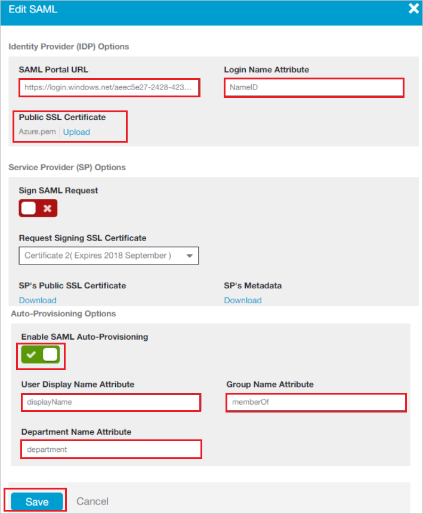

## Prerequisites

To configure Azure AD integration with Zscaler Internet Access Administrator, you need the following items:

- An Azure AD subscription
- A Zscaler Internet Access Administrator single sign-on enabled subscription

> **Note:**
> To test the steps in this tutorial, we do not recommend using a production environment.

To test the steps in this tutorial, you should follow these recommendations:

- Do not use your production environment, unless it is necessary.
- If you don't have an Azure AD trial environment, you can [get a one-month trial](https://azure.microsoft.com/pricing/free-trial/).

### Configuring Zscaler Internet Access Administrator for single sign-on

1. In a different web browser window, log in to your Zscaler Internet Access Administrator company site as an administrator.

2. Go to **Administration > Authentication > Authentication Settings** and perform the following steps:
   
	

	a. Under Authentication Type, choose **SAML**.

	b. Click **Configure SAML**.

3. On the **Edit SAML** window, perform the following steps and click Save.  
   			
	
	
	a. In the **SAML Portal URL** textbox, Paste the **Login URL** : %metadata:singleSignOnServiceUrl% which you have copied from Azure portal.

	b. In the **Login Name Attribute** textbox, enter **NameID**.

	c. Click **Upload**, to  upload the **[Downloaded Azure AD Signing Certifcate (Base64 encoded)](%metadata:certificateDownloadBase64Url%)** from Azure portal in the **Public SSL Certificate**.

	d. Toggle the **Enable SAML Auto-Provisioning**.

	e. In the **User Display Name Attribute** textbox, enter **displayName** if you want to enable SAML auto-provisioning for displayName attributes.

	f. In the **Group Name Attribute** textbox, enter **memberOf** if you want to enable SAML auto-provisioning for memberOf attributes.

	g. In the **Department Name Attribute** Enter **department** if you want to enable SAML auto-provisioning for department attributes.

	i. Click **Save**.

4. On the **Configure User Authentication** dialog page, perform the following steps:

    

	a. Hover over the **Activation** menu near the bottom left.

    b. Click **Activate**.

## Quick Reference

* **Azure AD Single Sign-On Service URL** : %metadata:singleSignOnServiceUrl%

* **[Download Azure AD Signing Certifcate (Base64 encoded)](%metadata:certificateDownloadBase64Url%)**

## Additional Resources

* [How to integrate Zscaler Internet Access Administrator with Azure Active Directory](https://docs.microsoft.com/azure/active-directory/saas-apps/zscaler-internet-access-administrator-tutorial)
