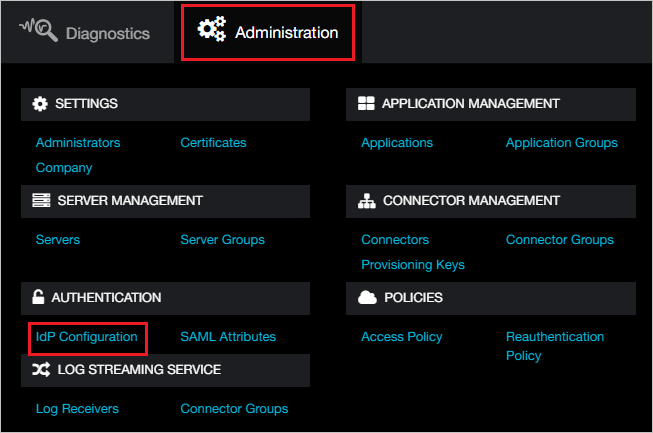
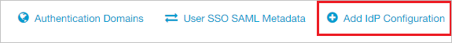
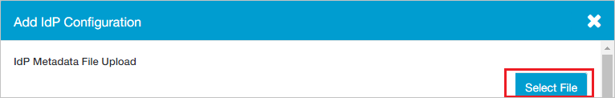
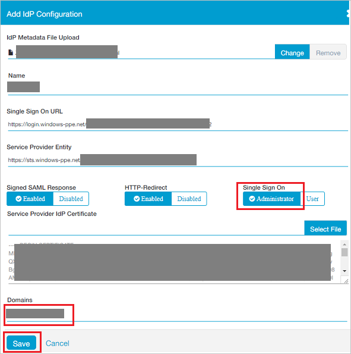

## Prerequisites

To configure Azure AD integration with Zscaler Private Access Administrator, you need the following items:

- An Azure AD subscription
- A Zscaler Private Access Administrator single sign-on enabled subscription

> **Note:**
> To test the steps in this tutorial, we do not recommend using a production environment.

To test the steps in this tutorial, you should follow these recommendations:

- Do not use your production environment, unless it is necessary.
- If you don't have an Azure AD trial environment, you can [get a one-month trial](https://azure.microsoft.com/pricing/free-trial/).

### Configuring Zscaler Private Access Administrator for single sign-on

1. In a different web browser window, login to Zscaler Private Access Administrator as an Administrator.

2. On the top, click **Administration** and navigate to **AUTHENTICATION** section click **IdP Configuration**.

	

3. In the top right corner, click **Add IdP Configuration**. 

	

4. On the **Add IdP Configuration** page perform the following steps:
 
	

	a. Click **Select File** to upload the **[Downloaded SAML Metadata file](%metadata:metadataDownloadUrl%)** from Azure AD in the **IdP Metadata File Upload** field.

	b. It reads the **IdP metadata** from Azure AD and populates all the fields information as shown below.

	

	c. Select **Single Sign On** as **Administrator**.

	d. Select your domain from **Domains** field.
	
	e. Click **Save**.

## Quick Reference

* **[Download SAML Metadata file](%metadata:metadataDownloadUrl%)**

## Additional Resources

* [How to integrate Zscaler Private Access Administrator with Azure Active Directory](https://docs.microsoft.com/azure/active-directory/active-directory-saas-zscalerprivateaccessadministrator-tutorial)
