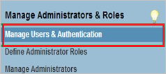
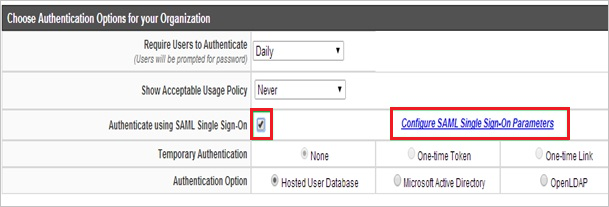
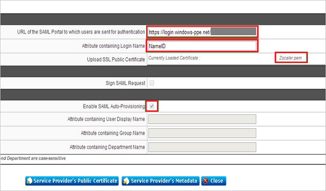

## Prerequisites

To configure Azure AD integration with Zscaler Three, you need the following items:

- An Azure AD subscription
- A Zscaler Three single sign-on enabled subscription

> **Note:**
> To test the steps in this tutorial, we do not recommend using a production environment.

To test the steps in this tutorial, you should follow these recommendations:

- Do not use your production environment, unless it is necessary.
- If you don't have an Azure AD trial environment, you can [get a one-month trial](https://azure.microsoft.com/pricing/free-trial/).

### Configuring Zscaler Three for single sign-on

1. In a different web browser window, log in to your Zscaler Three company site as an administrator.

2. In the menu on the top, click **Administration**.

	

3. Under **Manage Administrators & Roles**, click **Manage Users & Authentication**.

	

4. In the **Choose Authentication Options for your Organization** section, perform the following steps:

	

    a. Select **Authenticate using SAML Single Sign-On**.

    b. Click **Configure SAML Single Sign-On Parameters**.

5. On the **Configure SAML Single Sign-On Parameters** dialog page, perform the following steps, and then click **Done**

	

	a. Paste the **Login URL** value, which you have copied from the Azure portal into the **URL of the SAML Portal to which users are sent for authentication** textbox.

	b. In the **Attribute containing Login Name** textbox, type **NameID**.

	c. To upload your downloaded certificate, click **Zscaler pem**.

	d. Select **Enable SAML Auto-Provisioning**.

6. On the **Configure User Authentication** dialog page, perform the following steps:

    

    a. Click **Save**.

    b. Click **Activate Now**.

## Configuring proxy settings

### To configure the proxy settings in Internet Explorer

1. Start **Internet Explorer**.

2. Select **Internet options** from the **Tools** menu for open the **Internet Options** dialog.

	 

3. Click the **Connections** tab.
  
	 

4. Click **LAN settings** to open the **LAN Settings** dialog.

5. In the Proxy server section, perform the following steps:

	

    a. Select **Use a proxy server for your LAN**.

    b. In the Address textbox, type **gateway.zscalerthree.net**.

    c. In the Port textbox, type **80**.

    d. Select **Bypass proxy server for local addresses**.

    e. Click **OK** to close the **Local Area Network (LAN) Settings** dialog.

6. Click **OK** to close the **Internet Options** dialog.

## Quick Reference

* **Azure AD Single Sign-On Service URL** : %metadata:singleSignOnServiceUrl%

* **Azure AD Sign Out URL** : %metadata:singleSignOutServiceUrl%

* **Azure AD SAML Entity ID** : %metadata:IssuerUri%

* **[Download Azure AD Signing Certifcate (Base64 encoded)](%metadata:certificateDownloadBase64Url%)**

## Additional Resources

* [How to integrate Zscaler Three with Azure Active Directory](https://docs.microsoft.com/azure/active-directory/saas-apps/zscalerthree-tutorial)
